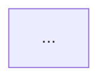

# Architecture Overview Report

## Purpose

Turn the per-repo `<repo>-architecture.md` files produced by `assess-repo` Task 1 (Architecture Analysis) into a single portfolio-level document that shows how the assessed systems actually integrate and depend on each other — not just how each one looks internally. This is a synthesis step: it reads existing file:line-cited findings and visualizes them; it does not perform new repository investigation.

## When to run

After `assess-repo` Phase 2 has produced `docs/assessment/<repo>-<YYYY-MM-DD>-architecture.md` for every included repo (or a portfolio-level architecture file for a non-git parent workspace). Skip only if fewer than 2 repos were assessed — a single-repo assessment has no cross-repo integration story to diagram; in that case, embed just that repo's internal component diagram in the executive summary instead of a portfolio context diagram.

## Inputs

- Every `docs/assessment/<repo>-<YYYY-MM-DD>-architecture.md` file from Phase 2.
- `docs/assessment/assessment-manifest.json` (repo inventory, scope).
- `docs/assessment/normalized-findings.json` (for severity/risk cross-referencing, if present).

## Procedure

1. **Read every per-repo architecture file in full** (not just the exec-summary one-liner already written about it — that's a lossy compression). Extract:
   - Named components/services and what they do.
   - Explicit integration points with file:line citations (e.g. "soc-bff (port 8080) ← soc-console").
   - Explicit dependency/coupling findings, especially ones flagged High/Critical severity.
   - Shared cross-repo contracts or libraries (e.g. a schema/proto package consumed by multiple repos).
2. **Identify platform groupings.** Real portfolios are rarely one monolithic system — group repos into the platforms/products they actually belong to (by shared auth provider, shared data store, shared deployment pipeline, or explicit dependency edges found in step 1). Do not force unrelated products into one diagram; a standalone product with no cross-repo edges gets its own subgraph or is noted as isolated.
3. **Distinguish evidence tiers explicitly.** Some repos will have deep-dive file:line integration analysis; others (e.g. a portfolio scanned only for repo inventory/structure) will have only structural signals (language, manifest presence, no confirmed runtime edges). Label edges/diagrams built from the latter as lower-confidence in the document text — never draw an inferred edge with the same visual weight as a file:line-cited one without saying so.
4. **Build diagrams with Mermaid**, one per logical concern:
   - One portfolio system-context diagram (`graph TB`) showing platform groupings and their primary integration edges (auth, deployment, data).
   - One diagram per platform/system with a nontrivial internal architecture (layered `graph TD`, or a component `graph LR`), pulled directly from that repo's Layering Assessment / Component Architecture sections.
   - Only diagram what is already documented — never invent a component, port, or protocol not present in the source architecture file.
5. **Validate every diagram before publishing.** Extract each ` ```mermaid ` block and render it with the actual renderer, not by eyeballing syntax:
   ```bash
   npx -y @mermaid-js/mermaid-cli -i diagram.mmd -o diagram.svg
   ```
   A diagram that fails to render (or renders as an empty/near-empty SVG) must be fixed before the document is considered done. Do not ship unvalidated Mermaid.
6. **Write the cross-cutting integration points table**: one row per shared dependency (an auth provider, a deployment platform, a shared library/contract, a shared data store) with columns for consumers, evidence source, and the specific risk already documented in the per-repo findings (e.g. "no CI gate validates the contract" or "no sync-wave ordering").
7. **Summarize the highest-leverage architectural risks** (5-8 items) — each one must be traceable to a specific diagram/finding above, ranked by blast radius (a risk that silently breaks production for many consumers ranks above a risk isolated to one component).
8. Save to `docs/assessment/architecture-overview-<YYYY-MM-DD>.md`.

## Output structure

```markdown
# <Portfolio/Repo> — Architectural Overview

**Date:** YYYY-MM-DD
**Sources:** [list every <repo>-architecture.md consumed]

[1-2 sentence framing of the real platform/product groupings found, with confidence caveats for any inferred-only edges.]

## 1. Portfolio System Context


## 2. <Platform Name> — <layering/component focus>

[Repeat per platform/system with nontrivial internal architecture.]

## N. Cross-Cutting Integration Points
| Integration point | Consumers | Evidence | Risk |
|---|---|---|---|

## N+1. Summary of Architecturally Significant Risks
[Ranked list, each traceable to a diagram/finding above.]
```

## Rules

- Every diagram must be validated with `mermaid-cli` before the document is finalized (Procedure step 5). Report the validation as done, not assumed.
- Every edge in a diagram must trace to a specific finding, quote, or file:line citation in a source `<repo>-architecture.md` — or be explicitly marked inferred/lower-confidence in surrounding prose.
- Do not merge genuinely separate products/platforms into one diagram just because they were assessed in the same portfolio run — a standalone product (no cross-repo integration evidence) gets its own subgraph or a note that it is isolated.
- Keep node labels short; put detail (LOC counts, file paths, severities) in edge labels, surrounding prose, or the integration-points table, not crammed into node text.
- This document feeds the executive summary (see `skill://assessment-report-suite` Phase 5) — the portfolio system-context diagram (only) is embedded directly in the executive summary; the rest is referenced by link, not duplicated inline, to keep the executive summary readable.
